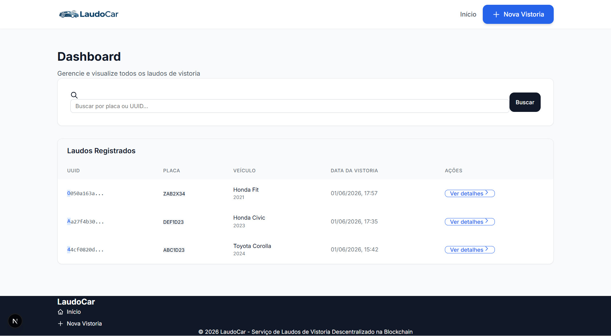
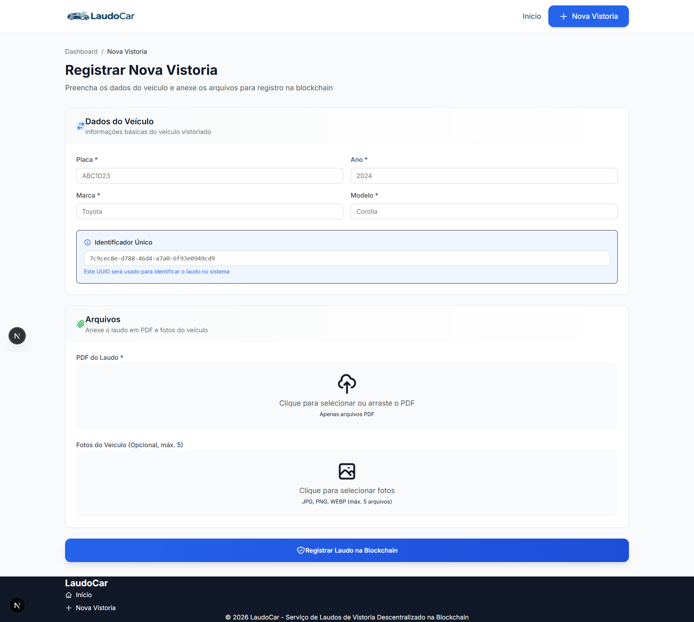
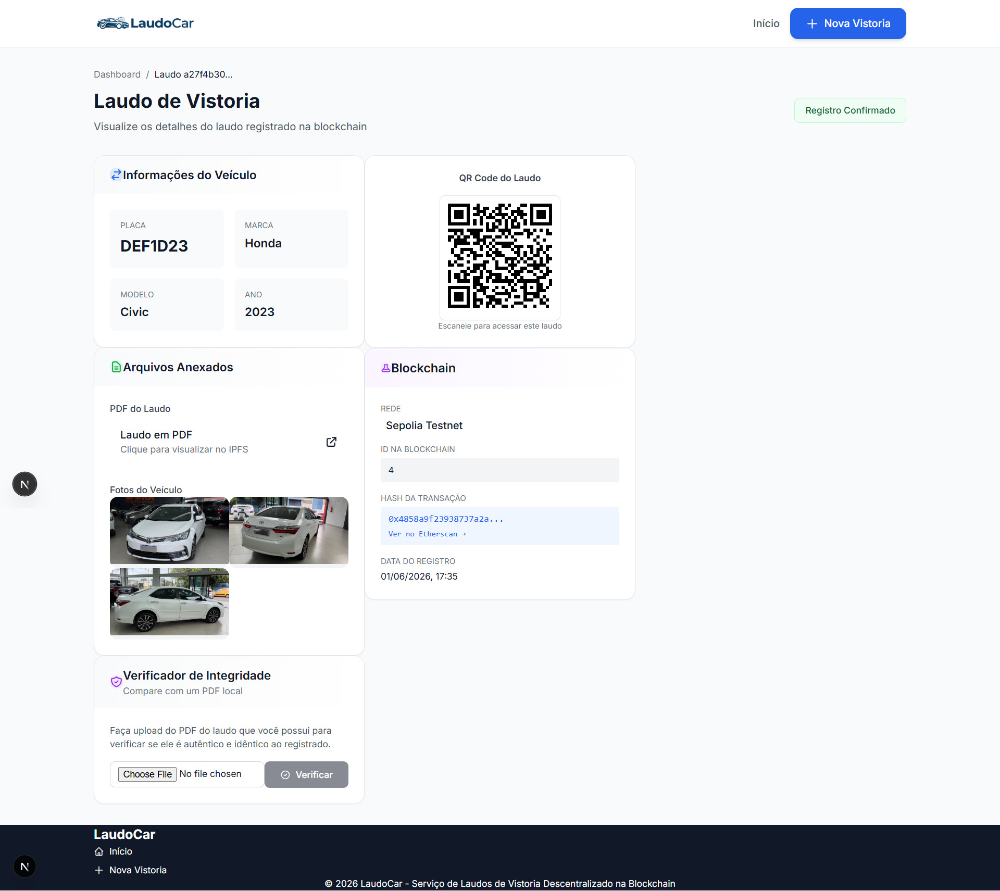

# 🚗 LaudoCar

> **Registro imutável de vistorias e laudos veiculares na blockchain Ethereum Sepolia.**

[](https://soliditylang.org/)
[](https://openzeppelin.com/contracts/)
[](https://sepolia.etherscan.io/)
[](https://pinata.cloud/)
[](https://www.postgresql.org)
[](https://nextjs.org/)

---

## 🎥 Entrega do Projeto

> **Site:** [https://laudocar-opal.vercel.app](https://laudocar-opal.vercel.app)

> **Vídeo-pitch:** [https://youtu.be/F7ZxB0--q2M](https://youtu.be/F7ZxB0--q2M)

> **Slides:** [https://raw.githubusercontent.com/minichiello/LaudoCar/refs/heads/main/slides/LaudoCar.pdf](https://raw.githubusercontent.com/minichiello/LaudoCar/refs/heads/main/slides/LaudoCar.pdf)
---

## 📋 Sobre o Projeto

O **LaudoCar** é uma **plataforma intermediária** que conecta **vistoriadores profissionais** e **seguradoras** através da tecnologia blockchain, garantindo a **veracidade absoluta** dos laudos veiculares, participante do desafio ProofChain do Hackathon Web3 RESTIC 29.

Ao atuar como camada de confiança entre essas partes, o LaudoCar elimina a necessidade de seguradoras verificarem manualmente a autenticidade de documentos — cada laudo registrado é **imutável**, **auditável** e **verificável** por qualquer pessoa.

### 🎯 Como funciona o modelo de negócio

| Parte | Papel | Benefício com Blockchain |
|-------|-------|--------------------------|
| **Vistoriador** | Realiza a vistoria e registra o laudo assinando com sua carteira MetaMask | Credibilidade inquestionável — seu endereço fica registrado no laudo para sempre |
| **Seguradora** | Consulta e valida laudos de forma instantânea, sem intermediários | Eliminação de fraudes, redução de custos de verificação e agilidade no processo |
| **Proprietário do veículo** | Recebe um laudo com garantia de integridade | Segurança contra laudos falsificados ao vender ou fazer seguro do veículo |

As **vantagens do blockchain** tornam esse intermediário digital mais seguro que qualquer sistema tradicional:

- **Imutabilidade**: Uma vez registrado, o laudo não pode ser alterado — nem por vistoriadores, nem pela plataforma
- **Transparência**: Qualquer seguradora pode verificar o histórico completo de vistorias de um veículo sem depender de terceiros
- **Custos reduzidos**: Elimina processos manuais de validação e auditoria de documentos
- **Confiança programável**: A própria matemática criptográfica garante a autenticidade, sem necessidade de autoridades centralizadas

### O problema que resolvemos

O mercado de veículos usados sofre com laudos falsificados, datas adulteradas e fotos manipuladas. Documentos em papel ou PDFs comuns podem ser facilmente forjados. O LaudoCar elimina esse problema ao:

- Gravar o **hash SHA-256** do PDF do laudo na blockchain
- Armazenar o PDF e as fotos no **IPFS** (sistema de arquivos descentralizado)
- Registrar o endereço carteira do **vistoriador** que assinou a transação
- Permitir que **qualquer pessoa** verifique a autenticidade do laudo sem precisar de carteira ou conta

---

## 🏗️ Arquitetura

```
┌─────────────────────────────────────────────────────────────┐
│                        LAUDOCAR                             │
│                                                             │
│  ┌──────────────┐   ┌───────────────┐   ┌───────────────┐   │
│  │  PostgreSQL  │   │  IPFS/Pinata  │   │ Blockchain    │   │
│  │              │   │               │   │ Ethereum      │   │
│  │              │   │  PDF do Laudo │   │ Sepolia       │   │
│  │  Listagem    │   │  Fotos        │   │               │   │
│  │  Busca rápida│   │               │   │ Hash PDF      │   │
│  │  por placa   │   │  CIDs públicos│   │ CIDs IPFS     │   │
│  │  Indexação   │   │               │   │ Endereço      │   │
│  │  de UUIDs    │   │               │   │ Timestamp     │   │
│  └──────────────┘   └───────────────┘   └───────────────┘   │
│     Off-chain        Descentralizado        On-chain        │
└─────────────────────────────────────────────────────────────┘
```

| Camada | Tecnologia | Finalidade |
|--------|-----------|------------|
| **Off-chain** | Banco de Dados | Listagem rápida, busca por placa, indexação |
| **Descentralizado** | IPFS | Armazenamento permanente do PDF e fotos |
| **On-chain** | Ethereum | Registro imutável, auditoria pública |
| **Frontend** | Next.js | Interface Web, sem instalações para o usuário |

---

## 🛠️ Stack Tecnológica

| Tecnologia       | Versão | Uso                                                                      |
|------------------|--------|--------------------------------------------------------------------------|
| **Solidity**     | v0.8   | Linguagem de Programação para Smart Contract                             |
| **Ethers.js**    | v6     | Biblioteca JavaScript de Comunicação com o Smart Contract via MetaMask   |
| **Hardhat**      | v2     | Compilação, testes e deploy do contrato                                  |
| **OpenZeppelin** | v5     | Biblioteca auditada de contratos Solidity                                |
| **Pinata**       | -      | Upload e gateway IPFS                                                    |
| **Next.js**      | v16    | Framework full-stack                                                     |
| **Supabase**     | -      | Banco de dados PostgreSQL                                                |

---

## 📜 Smart Contract — `LaudoCar.sol`

Endereço na Sepolia: `0xc4672e22836cBD7e44924C29C989Fcc0556CC96e`  
[Ver no Etherscan →](https://sepolia.etherscan.io/address/0xc4672e22836cBD7e44924C29C989Fcc0556CC96e)

### Estruturas de Dados

```solidity
struct Veiculo {
    string uuid;    // Identificador único gerado no frontend (UUID v4)
    string placa;   // Placa do veículo (ex: "ABC1D23")
    string marca;   // Marca do fabricante (ex: "Toyota")
    string modelo;  // Modelo do veículo (ex: "Corolla")
    uint16 ano;     // Ano de fabricação
}

struct Laudo {
    uint256 id;              // ID sequencial gerado pelo contrato
    address vistoriador;     // Endereço da carteira que registrou o laudo
    Veiculo veiculo;         // Dados do veículo (struct aninhado)
    string ipfsPdfCID;       // CID do PDF do laudo no IPFS
    string[] ipfsFotosCID;   // Array de CIDs das fotos
    uint256 timestamp;       // Data/hora do registro (block.timestamp)
}
```

### Funções Públicas

#### `registrarLaudo(...)` — Escrita | Requer MetaMask

```solidity
function registrarLaudo(
    string memory _uuid,
    string memory _placa,
    string memory _marca,
    string memory _modelo,
    uint16 _ano,
    string memory _ipfsPdfCID,
    string[] memory _ipfsFotosCID
) public nonReentrant returns (uint256)
```

**O que faz:** Registra um novo laudo de vistoria na blockchain.

**Validações internas:**
- `require(bytes(_placa).length > 0)` — Placa não pode ser vazia
- `require(bytes(_ipfsPdfCID).length > 0)` — CID do PDF obrigatório
- `require(_ipfsFotosCID.length <= 5)` — Máximo de 5 fotos por laudo

**Retorna:** O `id` numérico do laudo criado no contrato.

**Emite o evento:** `LaudoRegistrado(id, vistoriador, placa, ipfsPdfCID)`

---

#### `obterLaudosPorPlaca(string _placa)` — Leitura | Gratuito

```solidity
function obterLaudosPorPlaca(string memory _placa)
    public view returns (uint256[] memory)
```

**O que faz:** Retorna todos os IDs de laudos registrados para uma placa específica. Permite verificar o histórico completo de vistorias de um veículo.

**Retorna:** Array de `uint256` com os IDs dos laudos.

---

#### Mapping público `laudos`

```solidity
mapping(uint256 => Laudo) public laudos;
```

Permite consultar diretamente um laudo pelo ID. Qualquer pessoa pode acessar via RPC público da Sepolia, **sem precisar de carteira ou MetaMask**.

---

### Evento

```solidity
event LaudoRegistrado(
    uint256 indexed id,
    address indexed vistoriador,
    string placa,
    string ipfsPdfCID
);
```

Os campos `indexed` permitem filtrar eventos por `id` ou por `vistoriador` no Etherscan e em ferramentas de monitoramento on-chain.

---

## 🔒 Proteção contra Reentrância

### O que é um ataque de reentrância?

Um ataque de reentrância ocorre quando um contrato malicioso chama de volta (`re-enter`) uma função do contrato alvo **antes que a execução original termine**, explorando o estado ainda não atualizado para executar ações não autorizadas múltiplas vezes em uma única transação.

### Por que é crítico no LaudoCar?

No contexto do LaudoCar, um ataque de reentrância sem proteção poderia permitir que um atacante:

1. Chamasse `registrarLaudo` com dados de um veículo
2. Antes da função finalizar e incrementar `_proximoId`, reinvocasse `registrarLaudo`
3. Registrasse múltiplos laudos falsos com o mesmo ID ou com dados adulterados em uma única transação — comprometendo a **integridade do histórico veicular**

Como o laudo é um documento legal/comercial vinculado a um veículo real, a adulteração do registro na blockchain poderia causar fraudes em transações.

### Como foi implementado

Foi utilizado o **`ReentrancyGuard` do OpenZeppelin** — a biblioteca de contratos Solidity mais auditada e reconhecida da indústria:

```solidity
import "@openzeppelin/contracts/utils/ReentrancyGuard.sol";

contract LaudoCar is ReentrancyGuard {
    // ...
    function registrarLaudo(...) public nonReentrant returns (uint256) {
        // ...
    }
}
```

O modificador `nonReentrant` do OpenZeppelin utiliza internamente o mesmo padrão de bloqueio mutex, mas com implementação auditada por especialistas em segurança. O padrão **Checks-Effects-Interactions (CEI)** também foi respeitado: todas as validações (`require`) ocorrem antes de qualquer alteração de estado.

---

## 🔍 Segurança & Auditoria

### Hardhat — Testes Unitários

Os testes unitários garantem o comportamento correto do contrato antes do deploy.

```bash
# Dentro da pasta contracts/
npm run test
```

**O que é testado:**
- Registro correto de um laudo com todos os campos
- Verificação dos dados gravados no mapping
- Proteção contra mais de 5 fotos
- Emissão correta do evento `LaudoRegistrado`
- Prevenção de reentrância

---

### Slither — Análise Estática

[Slither](https://github.com/crytic/slither) é uma ferramenta de análise estática que detecta vulnerabilidades comuns em Solidity sem executar o código.

```bash
# Na raiz do projeto contracts/
slither .
```

**O que verifica:** Reentrância, variáveis não inicializadas, uso incorreto de `tx.origin`, funções com visibilidade errada, entre outros.

---

### Mythril — Análise Simbólica

[Mythril](https://github.com/Consensys/mythril) utiliza execução simbólica para simular todos os caminhos possíveis de execução do contrato e detectar falhas de segurança.

```bash
myth analyze contracts/LaudoCar.sol
```

**O que verifica:** Integer overflow/underflow, acesso não autorizado, manipulação de timestamp, delegatecall inseguro, entre outros.

---

## 🚀 Fluxo de Uso

### Para o Vistoriador (requer MetaMask + ETH Sepolia)

```
1. Acessa /novo-laudo
2. Preenche dados do veículo (placa, marca, modelo, ano)
3. Faz upload do PDF do laudo e até 5 fotos
4. Clica em "Registrar Laudo na Blockchain"
   ├── Arquivos enviados ao IPFS via Pinata
   ├── MetaMask abre para assinar a transação
   ├── Contrato registra laudo on-chain
   └── Dados indexados no Supabase
5. Recebe QR Code com link para consulta pública
```

### Para o Cliente / Público Geral (sem MetaMask, sem conta)

> ✅ **Nenhuma instalação ou cadastro necessário.**

O cliente recebe o **link direto** ou o **QR Code** do laudo e acessa pelo navegador. A leitura dos dados é feita diretamente via **RPC público da Sepolia** — qualquer pessoa pode verificar a autenticidade sem depender da plataforma, sem carteira digital e sem pagar taxas.

```
Cliente recebe URL: https://example.com/laudo/[uuid]
         OU
Cliente escaneia QR Code com o celular
         │
         ▼
Página exibe: dados do veículo, PDF, fotos, hash da transação
         │
         ▼
Opcional: arrasta o PDF que possui → sistema calcula SHA-256
         └── Compara com o hash registrado na blockchain
             ├── ✅ "Laudo Autêntico e Íntegro"
             └── ❌ "Laudo não confere — possível adulteração"
```

---

## 🖥️ Telas da Aplicação

### Dashboard (`/`)
Lista todos os laudos registrados com busca por placa ou UUID. Permite acesso rápido a qualquer laudo.



### Nova Vistoria (`/novo-laudo`)
Formulário completo para registro de novo laudo: dados do veículo, upload de PDF e fotos, integração MetaMask e progresso em tempo real.



### Consulta do Laudo (`/laudo/[id_uuid]`)
Visualização completa do laudo com: dados do veículo, PDF e fotos via IPFS, informações da transação na blockchain, QR Code e **verificador de integridade de PDF**.



---

## ⚙️ Como Executar Localmente

### Pré-requisitos

- Node.js 18+
- MetaMask
- Conta no [Supabase](https://supabase.com/)
- Conta no [Pinata](https://pinata.cloud/)
- ETH de teste na rede Sepolia

### 1. Clonar e instalar dependências

```bash
git clone https://github.com/minichiello/laudocar.git
cd laudocar
npm install
```

### 2. Configurar variáveis de ambiente

Crie o arquivo `.env.local` na raiz:

```env
NEXT_PUBLIC_SUPABASE_URL=https://xxxx.supabase.co
NEXT_PUBLIC_SUPABASE_ANON_KEY=sua_anon_key
PINATA_JWT=seu_pinata_jwt
NEXT_PUBLIC_CONTRACT_ADDRESS=0xSeuEnderecoDoContrato
NEXT_PUBLIC_SEPOLIA_RPC_URL=https://sepolia.infura.io/v3/sua_chave
```

### 3. Configurar o banco de dados (Supabase)

Execute no SQL Editor do Supabase:

```sql
CREATE EXTENSION IF NOT EXISTS "uuid-ossp";

CREATE TABLE laudos (
    id UUID PRIMARY KEY DEFAULT uuid_generate_v4(),
    placa VARCHAR(10) NOT NULL,
    marca VARCHAR(50) NOT NULL,
    modelo VARCHAR(50) NOT NULL,
    ano INT NOT NULL,
    ipfs_pdf_cid TEXT NOT NULL,
    ipfs_fotos_cid TEXT[] NOT NULL,
    tx_hash TEXT NOT NULL,
    id_blockchain NUMERIC,
    created_at TIMESTAMP WITH TIME ZONE DEFAULT TIMEZONE('utc', NOW()) NOT NULL
);

ALTER TABLE laudos ENABLE ROW LEVEL SECURITY;
CREATE POLICY "Permitir insercao publica" ON laudos FOR INSERT WITH CHECK (true);
CREATE POLICY "Permitir leitura publica" ON laudos FOR SELECT USING (true);
```

### 4. Deploy do Smart Contract (opcional)

```bash
cd contracts
npm install
npx hardhat run scripts/deploy.js --network sepolia
```

### 5. Executar o servidor de desenvolvimento

```bash
npm run dev
```

Acesse: [http://localhost:3000](http://localhost:3000)

### 6. Rodar os testes do contrato

```bash
cd contracts
npm run test
```

---

## 📁 Estrutura do Projeto

```
laudocar/
├── src/
│   ├── app/
│   │   ├── page.tsx                  # Dashboard
│   │   ├── novo-laudo/page.tsx       # Formulário de cadastro
│   │   ├── laudo/[id_uuid]/page.tsx  # Consulta pública do laudo
│   │   ├── api/upload-ipfs/route.ts  # API Route: upload para Pinata
│   │   └── layout.tsx                # Layout global
│   ├── components/
│   │   ├── Header.tsx
│   │   └── Footer.tsx
│   └── lib/
│       ├── supabase.ts               # Cliente Supabase
│       └── contract.ts               # ABI e endereço do contrato
├── contracts/
│   ├── contracts/LaudoCar.sol        # Smart Contract
│   ├── test/LaudoCar.test.js         # Testes Hardhat
│   └── hardhat.config.js
├── public/
│   ├── LaudoCar.png
│   └── favicon.png
├── .env.example                      # Modelo para as variáveis de ambiente
├── .env.local                        # Variáveis de ambiente (não versionado)
└── README.md                         # Documentação do projeto
```

---

## 🤖 Uso de Inteligência Artificial

Este projeto utilizou o Claude como assistente de IA generativa para apoiar o desenvolvimento de código, revisões técnicas e documentação, com validação humana em todas as entregas.

---

### Equipe

Gerson Minichiello
